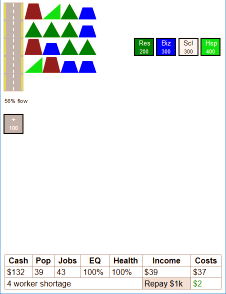

# SimpleCity

I had some 5 minute breaks in between a repetitive task so I made this using the DevTools workspace in Chrome. It's a 1D/2D City simulator with minimalist graphics using only CSS shapes - no images. All gameplay objects are simple DOM elements, it doesn't use Canvas or SVG. So in many ways, yes, it's really stupid. I don't make games :))))))

Along the way it half turned into a clicker/idle game, so bear in mind that leaving the window in the background helps!

You can play it at <https://stegriff.github.io/SimpleCity/>, I recommend you resize your window into phone-screen proportions. I don't know whether it works on actual phones because it uses mouse hover...

## Gameplay

 * Hover a road to bring up the build menu
 * Click a building name to build it (if you have sufficient funds)
     + Houses produce workers
	 + Businesses produce jobs
     + Schools increase EQ which creates more job stability
     + Hospitals increase Health which creates population stability
 * Roads are currently useless, you can build everything in one line if you want
     + Building more roads increases "Traffic flow" but this has no gameplay effect
     + There is currently no "commute time" simulation - anyone can work anywhere
 * The simulation ticks every 3 seconds and randomises population and job numbers slightly
 * Click 'Loan $1k' to borrow 1$k until you can pay it back. Comes with a -$10 costs penalty
 
## Q&A

 * What are the buildings supposed to be?
     - I suppose they're the rooves...
 * Why are roads useless?
     - Because I didn't finish it yet.
 * Is there any benefit to building certain buildings together?
     - Nope. There is an unused "neighbour happiness" value that is based on co-locating residential space.
 * It's hard! 
     - Not a question but yes it is, leave the window in the background anytime your cashflow is positive.
 * Why does it fluctuate between unemployed and worker shortage?
     - Because random
 * Why is this so rubbish, it's barely even a game
     - THank you yes, I did make it myself